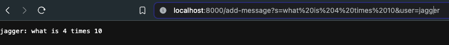
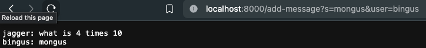
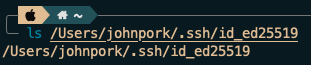
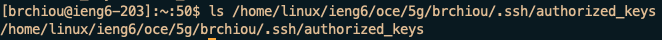
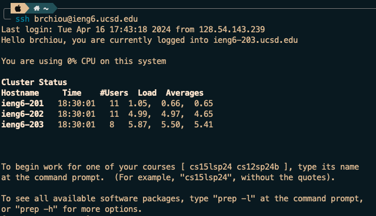

# Lab Report 2

## Part 1

### ChatServer.java

```
import java.io.IOException;
import java.net.URI;
import java.util.ArrayList;

class Handler implements URLHandler {
    // The one bit of state on the server: a number that will be manipulated by
    // various requests.
    ArrayList<String> messages = new ArrayList<>();

    private String messageString(ArrayList<String> messages) {
        StringBuilder str = new StringBuilder();
        for (String msg : messages) {
            str.append(msg);
        }
        return str.toString();
    }

    public String handleRequest(URI url) {
        if (url.getPath().contains("/add-message")) {
            String[] parameters = url.getQuery().split("[&=]");
            String user;
            String message;
            if (parameters[0].equals("s") && parameters[2].equals("user")) {
                message = parameters[1];
                user = parameters[3];
                messages.add(String.format("%s: %s\n", user, message));
                return messageString(messages);
            } else {
                return "wrong parameters";
            }

        } else {
            return url.getPath();
        }
    }
}

class ChatServer {
    public static void main(String[] args) throws IOException {
        if (args.length == 0) {
            System.out.println("Missing port number! Try any number between 1024 to 49151");
            return;
        }

        int port = Integer.parseInt(args[0]);

        Server.start(port, new Handler());
    }
}

```

### image 1



1. methods: `messageString, getQuery, split, format`
2. arguments: ArrayList of messages, the path of the URL, and String parameters of the path\
   `ArrayList<String> messages: ["jagger: what is 4 times 10\n"]`
3. `ArrayList<String> messages` had the message with the username string added to it (was empty before).

---

### image 2



1. methods: `messageString, getQuery, split, format`
2. arguments: ArrayList of updated messages, the path of the URL, and String parameters of the path\
   `ArrayList<String> messages: ["jagger: what is 4 times 10\n", "bingus: mongus\n"]`
3. `ArrayList<String> messages` had the new message added to the list.

## part 2







## part 3

I did not know how ssh keys worked before, and how they can be useful for other things like github and working on remote servers. I also learned about scp which would be very convenient for moving files around servers.
