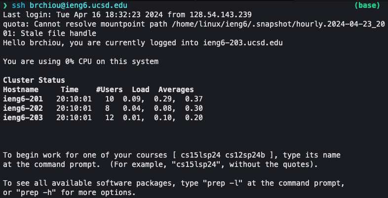
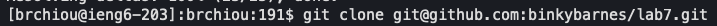
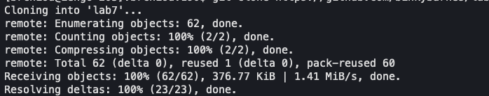
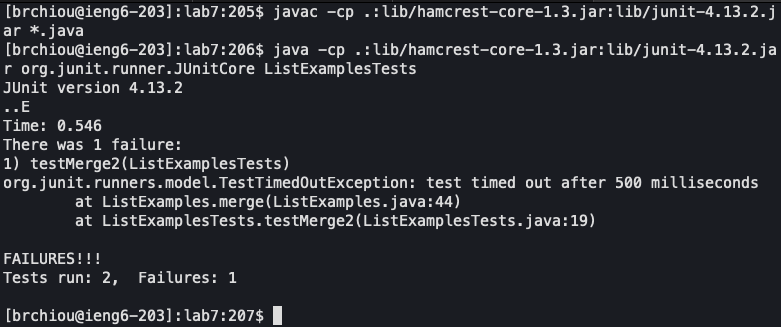
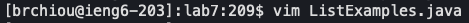
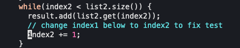
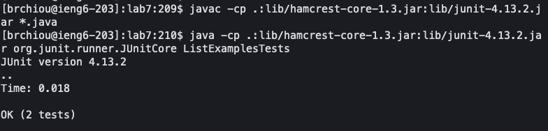
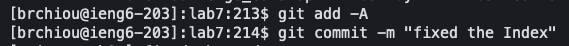
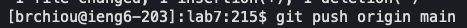
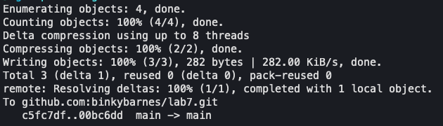

# Lab Report 4 - Vim

## Step 4

### 1

### 2

`<ssh brchiou@ieng6.ucsd.edu><enter>`

### 3

I typed in the address for the ieng6 server, and I ssh into it.

## Step 5

### 1

### 2

`<git clone git@github.com:binkybarnes/lab7.git><ll><cd lab7>`

### 3

Using the ssh link to the github repository, I git cloned it and changed directory to it.

## Step 6

### 1

### 2

`<cmd + c><cmd + p><cmd + c><cmd + p><backspace><backspace><backspace><ListExamplesTests>`

### 3

I copied the javac and java commands from the writeup and pasted them into the terminal. Then I changed the ... into the test file.

## Step 7

### 1

### 2

`<vim ListExamples.java><:44><e><s><2><:wq>`

### 3

From the above step, I see that the line 44 failed. So I open the file with vim, go that that line, and change the index1 to index2.

## Step 8

### 1

### 2

`<up><up><up><enter><up><up><up><enter>`

### 3

Since I had already typed those commands before, I press up arrow 3 times for each one.

## Step 9

### 1

### 2

`<git add -A><git commit -m "fixed index"><git push origin main>`

### 3

I added all the files, then I commit, then I push the changes.
