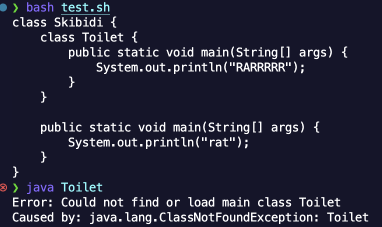
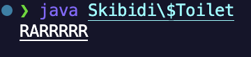

# Lab Report 5 - Putting it All Together (Week 9)

## Part 1 - Debugging Scenario

1.  Student: please help me i cant get it to run
    

2.  TA: Try this bro`java Skibidi\$Toilet`

3.  Student: THANK YOU SO MUCH
    

4.

- File tree
  ```
     .
    ├──  labreport5.md
    ├──  pic1.png
    ├──  pic2.png
    ├──  'Skibidi$Toilet.class'
    ├──  Skibidi.class
    ├──  skibidi.java
    └──  test.sh
  ```
- Contents of the file `skibidi.java` before

  ```
    class Skibidi {
        class Toilet {
            public static void main(String[] args) {
                System.out.println("RARRRRR");
            }
        }

        public static void main(String[] args) {
            System.out.println("rat");
        }
    }

  ```

- Contents of file `test.sh` before

  ```
  tee -a skibidi.java << END
  class Skibidi {
      class Toilet {
          public static void main(String[] args) {
              System.out.println("RARRRRR");
          }
      }

      public static void main(String[] args) {
          System.out.println("rat");
      }
  }
  END
  javac *.java
  ```

- Trigger bug

  ```
  bash test.sh
  java Toilet
  ```

- What to edit to fix.
  Since Toilet is an inner class, you need to chain them with a $ after the outer class. Make sure to escape the dollar sign too.
  `java Skibidi\$Toilet`

## Part 2

I am going to use vim motions, cause I got the vscode extension and I like how smooth it is. I hope to become better at vim motions so I can evolve to a neovim user.
